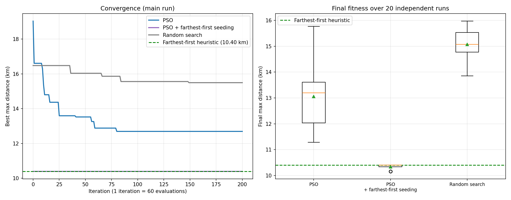

# EV Charging Station Placement for Greater Cairo
### Particle Swarm Optimization for a K-center facility location problem

This project chooses **15 EV charging station sites out of 200 candidates** so that the *farthest* residential neighborhood is as close as possible to its nearest station (the K-center problem). It solves the problem with a discrete **Particle Swarm Optimization (PSO)** and compares it against random search and a classic farthest-first heuristic.

> **Data note:** the 60 neighborhoods and 200 candidate sites are **synthetic**. They are generated around approximate coordinates of 15 real Cairo districts, so the results demonstrate the method, not a deployable plan. Real GIS / population data is listed under [Future work](#limitations-and-future-work).

---

## Table of contents
1. [Results](#results)
2. [Problem definition](#problem-definition)
3. [Method](#method)
4. [Data and assumptions](#data-and-assumptions)
5. [Project structure](#project-structure)
6. [Installation and usage](#installation-and-usage)
7. [Outputs](#outputs)
8. [Limitations and future work](#limitations-and-future-work)
9. [Motivation](#motivation)
10. [References](#references)
11. [Author and license](#author-and-license)

---

## Results

Setup: 60 neighborhoods, 200 candidates, K = 15, **12,060 fitness evaluations per run** (60 particles × 201 evaluations). Each stochastic method was run 20 times with different seeds. Distances are in km (projected, see [assumptions](#data-and-assumptions)).

| Method | Mean max distance (km) | Std (km) | Best run (km) |
|---|---|---|---|
| Random search (same budget) | 15.07 | 0.62 | 13.86 |
| **PSO** | **13.05** | 1.32 | 11.29 |
| **PSO seeded with farthest-first solution** | **10.34** | 0.10 | 10.16 |
| Farthest-first heuristic (deterministic) | 10.40 | 0 | 10.40 |

**What the numbers say**

- **PSO clearly beats random search** at an identical budget (13.05 vs 15.07 km on average; PSO's best run, 11.29 km, is well below random search's best, 13.86 km). PSO has higher run-to-run variance than random search (std 1.32 vs 0.62 km).
- **A simple problem-specific heuristic beats plain PSO** on this instance (10.40 vs 13.05 km). The max-distance objective is dominated by a few outlying neighborhoods, which the farthest-first rule targets directly.
- **Hybrid PSO** (a few particles seeded with the heuristic's solution) gives only a small refinement over the heuristic (10.34 km on average, best 10.16 km).
- In the main run (seed 42), plain PSO improved its best fitness from 19.03 km (best of the random initial swarm) to 12.69 km, a **33.3 % improvement over the initial swarm**.

**Delivered solution** (hybrid PSO, seed 42; used for the map and CSVs)

| Metric | Value |
|---|---|
| Max distance to nearest station | 10.40 km |
| Mean / median distance | 5.11 km / 5.02 km |
| Std of distances | 2.41 km |
| Within 2 km / 5 km / 10 km | 8.3 % / 48.3 % / 96.7 % |
| Minimum spacing between stations | 9.99 km (the 0.5 km spacing penalty is inactive) |

The search space is C(200, 15) ≈ **1.46 × 10²²** subsets; each run evaluates about 1.2 × 10⁴ of them.

A full run (1 main run + 60 benchmark runs) takes about **16 seconds**; a single PSO run takes about 0.2 s.



---

## Problem definition

Given neighborhoods `N` (60), candidate sites `L` (200) and `K = 15`:

```
minimize   max_{i in N}  min_{j in S}  d(i, j)        S ⊆ L, |S| = K
```

- `d(i, j)` is the Euclidean distance in kilometers after a local projection.
- Stations must be distinct (guaranteed by the encoding).
- A penalty of `10 × (0.5 km − min spacing)` is added when two stations are closer than 0.5 km.

K-center is NP-hard, so exhaustive search is impractical at this size and heuristics are used.

## Method

### Discrete PSO with random-key encoding

Each particle is a continuous vector of 200 *keys*, one per candidate site. A solution is decoded by selecting the **K sites with the largest keys** (random-key encoding, Bean 1994). Because positions are continuous, the standard PSO update applies unchanged, and every decoded particle is a valid set of K distinct sites:

```
v ← w·v + c1·r1·(pBest − x) + c2·r2·(gBest − x)
x ← x + v
```

`r1` and `r2` are drawn independently for every dimension; velocity is clamped to ±`V_MAX`.

| Parameter | Value |
|---|---|
| Particles | 60 |
| Iterations | 200 |
| Inertia `w` | 0.9 → 0.4 (linear decay) |
| `c1` (cognitive) / `c2` (social) | 1.5 / 1.5 |
| `V_MAX` | 0.5 |

### Baselines

- **Random search:** random K-subsets with the same evaluation budget.
- **Farthest-first heuristic:** a Gonzalez-style rule restricted to candidate sites. Start from the site with the lowest mean distance to all neighborhoods, then repeatedly open the candidate nearest to the currently worst-served neighborhood.
- **Hybrid PSO:** PSO where 6 of the 60 initial particles encode the farthest-first solution (one exact, five with noise).

## Data and assumptions

- **Neighborhoods (60):** 70 % are Gaussian-scattered around one of 15 real district centers (Downtown, Zamalek, Maadi, Heliopolis, Nasr City, New Cairo, 6th October City, …); 30 % are uniform in a ±0.45° box around the city center (roughly 100 km × 96 km).
- **Candidates (200):** the 15 district centers, a 10 × 10 regular grid, and random sites for the remainder.
- **Distance:** latitude/longitude are projected to kilometers around the city center. One degree of longitude is about 96 km at Cairo's latitude (not 111 km), so raw degree distances would distort east-west distances.
- **Reproducibility:** all randomness comes from seeded `numpy` generators (data seed 42; benchmark seeds listed in the code).
- Station costs, grid capacity, traffic, road network and demand are **not** modeled.

## Project structure

```
ev-charging-cairo-pso/
├── cairo_ev_charging_pso.py     # full implementation (also the source of the notebook)
├── Cairo_EV-final-fixed.ipynb   # same code as notebook cells, executed with outputs
├── requirements.txt
├── README.md
└── outputs/
    ├── cairo_ev_charging_map.html    # interactive map
    ├── cairo_ev_convergence.png      # convergence + benchmark figure
    ├── cairo_optimal_stations.csv    # delivered stations
    ├── cairo_neighborhoods.csv       # neighborhoods, assigned station, distance
    ├── cairo_benchmark.csv           # benchmark table
    └── cairo_results.json            # all metrics and per-run results
```

## Installation and usage

Requires Python 3.9+.

```bash
pip install -r requirements.txt
python cairo_ev_charging_pso.py          # writes everything to ./outputs
python cairo_ev_charging_pso.py --open   # also opens the map in the browser
```

Or open `Cairo_EV-final-fixed.ipynb` and run all cells. Parameters (swarm size, iterations, `K`, spacing, number of benchmark runs) are constants at the top of the script.

## Outputs

**Interactive map** (`cairo_ev_charging_map.html`): toggle layers for district centers, neighborhoods (popup shows nearest station and distance), stations (popup shows nearby district and neighborhoods served), neighborhood→station assignment lines, the covering radius, and landmarks. The basemap needs an internet connection.

**Station file** (`cairo_optimal_stations.csv`): `Station_ID, Latitude, Longitude, Index_in_Candidates, Nearest_District, Neighborhoods_Served`.

## Limitations and future work

**Limitations (observed in the results)**

- **The K-center objective is driven by outliers.** To shrink the *maximum* distance, the solution sends several stations to remote neighborhoods that serve one neighborhood each, while one central station serves 21. This is correct for the objective but probably not what a planner wants.
- **Plain PSO is not the best method here.** A deterministic heuristic matches or beats it, and the seeded hybrid adds only a small gain.
- All data is synthetic; the 30 % uniformly scattered neighborhoods exaggerate the outlier effect.

**Future work**

1. **Population-weighted objectives:** p-median or maximal coverage, so dense areas get more stations than isolated outliers.
2. **Real data:** OpenStreetMap / GIS neighborhood boundaries, population and existing stations, with candidate sites restricted to real parcels or parking areas.
3. **Network distance:** road travel time (e.g. with OSMnx) instead of straight-line distance.
4. **Multi-objective optimization:** cost, grid capacity, coverage and max-distance together (e.g. NSGA-II or multi-objective PSO).
5. **Station types and demand:** fast vs. slow chargers, time-varying demand, battery storage or solar.
6. **Stronger metaheuristics for comparison:** genetic algorithm, simulated annealing, local search with swaps.

## Motivation

Public charging availability is widely identified as a key factor in EV adoption, and placing stations well matters because each site has real installation and grid-connection costs. Greater Cairo is a natural test case because of its size, density and policy interest in cleaner transport. *Before presenting this project, add sourced local figures (EV counts, charger counts, national targets) from official publications; this README intentionally does not quote unverified statistics.*

## References

- Kennedy, J., & Eberhart, R. (1995). Particle swarm optimization. *Proc. IEEE ICNN'95*. DOI: 10.1109/ICNN.1995.488968
- Shi, Y., & Eberhart, R. (1998). A modified particle swarm optimizer. *IEEE ICEC*. DOI: 10.1109/ICEC.1998.699146
- Eberhart, R. C., & Shi, Y. (2000). Comparing inertia weights and constriction factors in particle swarm optimization. *Proc. CEC 2000*. DOI: 10.1109/CEC.2000.870279
- Clerc, M., & Kennedy, J. (2002). The particle swarm: explosion, stability, and convergence in a multidimensional complex space. *IEEE Trans. Evolutionary Computation*, 6(1). DOI: 10.1109/4235.985692
- Bean, J. C. (1994). Genetic algorithms and random keys for sequencing and optimization. *ORSA Journal on Computing*, 6(2), 154–160.
- Gonzalez, T. F. (1985). Clustering to minimize the maximum intercluster distance. *Theoretical Computer Science*, 38, 293–306.
- Daskin, M. S. (1995). *Network and Discrete Location: Models, Algorithms, and Applications*. Wiley.
- Harris, C. R., et al. (2020). Array programming with NumPy. *Nature*, 585, 357–362. DOI: 10.1038/s41586-020-2649-2
- Virtanen, P., et al. (2020). SciPy 1.0: Fundamental algorithms for scientific computing in Python. *Nature Methods*, 17, 261–272. DOI: 10.1038/s41592-019-0686-2
- Hunter, J. D. (2007). Matplotlib: A 2D graphics environment. *Computing in Science & Engineering*, 9(3), 90–95. DOI: 10.1109/MCSE.2007.55
- McKinney, W. (2010). Data structures for statistical computing in Python. *Proc. 9th Python in Science Conference*, 56–61.

## Author and license

**Mazen Shalaly** — Data Sceintist | AI Engineer  
Contacts :   
Email: mazenshalaly0@gmail.com   
LinkedIn: [Mazen Shalaly](https://www.linkedin.com/in/mazen-shalaly-1a2366310/?lipi=urn%3Ali%3Apage%3Ad_flagship3_profile_view_base_contact_details%3B4dyMLKSARPOLdJOEvjpEcg%3D%3D)


